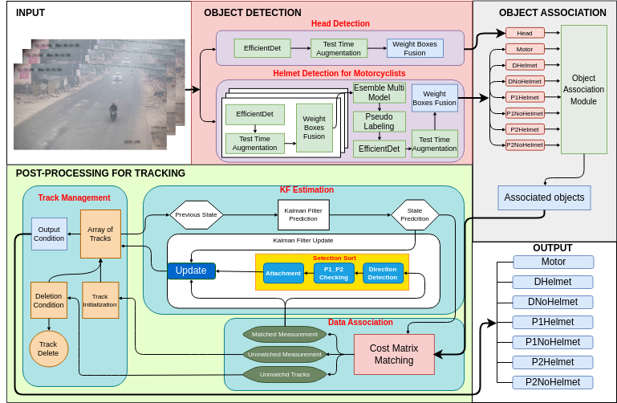

# AICITY2023_Track5
This repo includes solution for AICity2023 Challenge Track 5 - Detecting Violation of Helmet Rule for Motorcyclists


# Installation
Python 3.8 or later with dependencies listed in requirements.txt. Run the below command for install dependencies:
```commandline
pip install -r requirements.txt
```
# Data Preparation For Training
Download [the AICityChallenge dataset](https://www.aicitychallenge.org/2023-data-and-evaluation/)
 , which is provided by 2023 ACity Challenge Track 5 and put the download file into ./aicity_dataset/

Then using this command to split videos into frames for training, which will generate images corresponding to input videos inside the folder ./aicity_dataset/aicity2023_track5_images:
```commandline
python videos2images.py --video_folder ./aicity_dataset/aicity2023_track5/videos/ --save_folder ./aicity_dataset/aicity2023_track5_images/
python videos2images.py --video_folder ./aicity_dataset/aicity2023_track5_test/videos/ --save_folder ./aicity_dataset/aicity2023_track5_test_images/
```


# Reproduce the result on AICity 2023 Challenge Track 5
Our solution consists of 3 steps
## STEP 1 - Helmet Detection for Motorcyclists
### Training
The labels file is helmet_detection_for_motorcyclists/dataset/trainset_ai.csv

```commandline
cd helmet_detection_for_motorcyclists
python effdet_train.py --folds 1 --backbone ed5 --img-size 768 --batch-size 8
python effdet_train.py --folds 1 --backbone ed6 --img-size 640 --batch-size 8
python effdet_train.py --folds 0 1 --backbone ed6 --img-size 768 --batch-size 8
python effdet_train.py --folds 0 --backbone ed7 --img-size 768 --batch-size 8
python effdet_train.py --folds 0 1 2 --backbone ed7 --img-size 896 --batch-size 8
python effdet_train.py --folds 0 1 --backbone ed7 --img-size 1024 --batch-size 8
```
### Pseudo label
```commandline
python predict.py --folds 1 --backbone ed5 --img-size 768 --batch-size 8
python predict.py --folds 0 1 --backbone ed6 --img-size 768 --batch-size 8
python predict.py --folds 0 --backbone ed7 --img-size 768 --batch-size 8
python predict.py --folds 0 1 2 --backbone ed7 --img-size 896 --batch-size 8
python predict.py --folds 0 1 --backbone ed7 --img-size 1024 --batch-size 8
python ensemble.py
python pseudo_train.py --pretrain-path checkpoints/effdet_ed6_640_fold1.pth --checkpoint-path ./effdet_ed6_640_fold1.pth 
```


### Inference

```commandline
python predict.py --folds 1 --backbone ed6 --img-size 640 --batch-size 8
python finetune_label.py
```

## STEP 2 - Head Detection
### Training
The labels file is head_detection/dataset/trainset_head.csv

```commandline
cd head_detection
python effdet_train.py --folds 1 --backbone ed7 --img-size 768 --batch-size 8
```
### Inference

```commandline
python predict.py --folds 1 --backbone ed7 --img-size 768 --batch-size 8
python finetune_label.py
```

## STEP 3 - Post processing for tracking
In this step we used the result files of step 1 and step 2 and combined with the module object association to get the final result

```commandline
python infer.py --video-folder aicity_dataset/aicity2023_track5_test/videos/ --motorcyclist_helmet_output helmet_detection_for_motorcyclists/effdet_ed6_640_pseudo.txt --head_output head_detection/effdet_ed7_768_head.txt
```

## Note: We execute the training with one DGX node with 8 NVIDIA A100-40GB GPU


## Public Leaderboard
| TeamName           | mAP    |
|--------------------|--------|
| **IC_SmartVision** | 0.6997 |


## Citation

If you find our work useful, please cite the following:

```text
@inreview{vnpt-cvpr-2023,  
    author={Viet Hung Duong and Quang Huy Tran and Huu Si Phuc Nguyen and Duc Quyen Nguyen and Tien Cuong Nguyen},  
    title={Helmet Rule Violation Detection for Motorcyclists using a Custom
Tracking Framework and Advanced Object Detection Techniques},  
    booktitle={CVPR Workshop},
    year={2023}  
}
```

## Contact
Viet Hung Duong (hungdv@vnpt.vn)

Quang Huy Tran (tqhuy@vnpt.vn)

Huu Si Phuc Nguyen (phucnhs@vnpt.vn)

Duc Quyen Nguyen (quyennd2000@vnpt.vn)

Tien Cuong Nguyen (nguyentiencuong@vnpt.vn)
